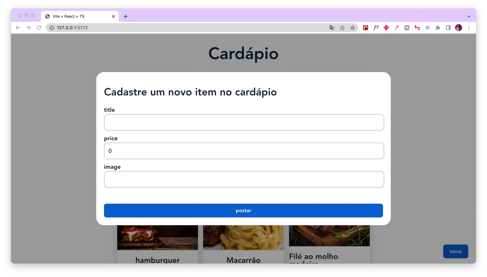

# Cardápio Digital - Aplicação Frontend

Desenvolvimento de um projeto simples de protótipo de um Cardápio Digital usando **React, Typescript e React Query**.

<h1 align="center">
    
    
</h1>

</br>

## 💻 Requisitos

Antes de iniciar, você deve ter o Node.js e o NPM instalados em sua máquina.

</br>

## 🚀 Instalando

Para instalar as dependências, execute o seguinte comando:

```bash
npm install
```

Por fim, para executar o projeto basta rodar o seguinte:

```bash
npm run dev
```
</br>

## 🔧 Compilação

Para compilar a aplicação para produção, execute o seguinte comando:

```bash
npm run build
```
Isso irá gerar uma versão otimizada da aplicação na pasta `dist`.

</br>

## 📝 Licença

Este projeto está licenciado sob a licença MIT. Consulte o arquivo `LICENSE` para obter mais informações.